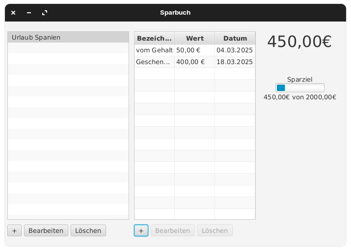

# Sparbuch Software

## Funktionen
- **Kontenverwaltung**: Nutzer können mehrere Konten erstellen, bearbeiten und löschen.
- **Transaktionsverwaltung**: Jede Transaktion kann hinzugefügt, bearbeitet und entfernt werden.
- **Automatische Berechnung der Konto-Balance**: Die Software berechnet den aktuellen Kontostand anhand der eingetragenen Transaktionen.

## Geplante Funktionen
- **Transaktions-Templates**: Wiederkehrende Buchungen können als Vorlagen gespeichert werden, um sie schnell erneut zu erstellen.

